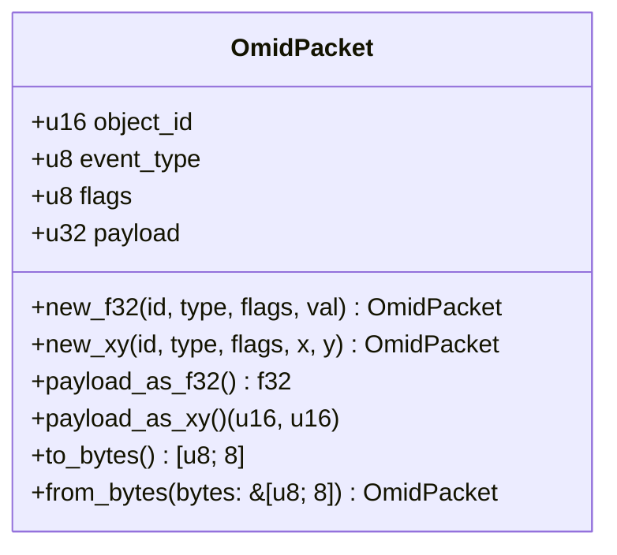
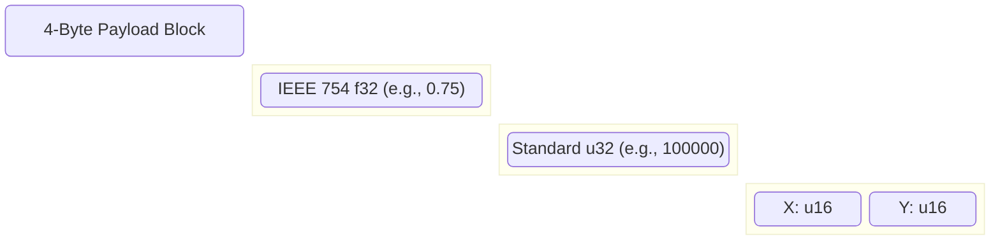

# Omid Diagrams

## 1. Packet Structure Layout



## 2. Hardware to Host Data Flow

This diagram illustrates the zero-copy pipeline from a physical hardware interaction to software consumption.

```mermaid
sequenceDiagram
    participant User
    participant MCU (Hardware)
    participant DMA Controller
    participant USB Endpoint
    participant Host Software (Rust)

    User->>MCU (Hardware): Moves Fader (Object ID: 1)
    MCU (Hardware)->>MCU (Hardware): Construct OmidPacket
    MCU (Hardware)->>DMA Controller: Write [u8; 8] into buffer
    DMA Controller->>USB Endpoint: Flush 8-byte packet
    USB Endpoint->>Host Software (Rust): USB Bulk Read Event
    Host Software (Rust)->>Host Software (Rust): OmidPacket::from_bytes()
    Host Software (Rust)->>User: Update UI / Audio Engine (f32)
```

## 3. Payload Interpretation

The 4-byte payload area is flexible depending on the constructor or getter used.

