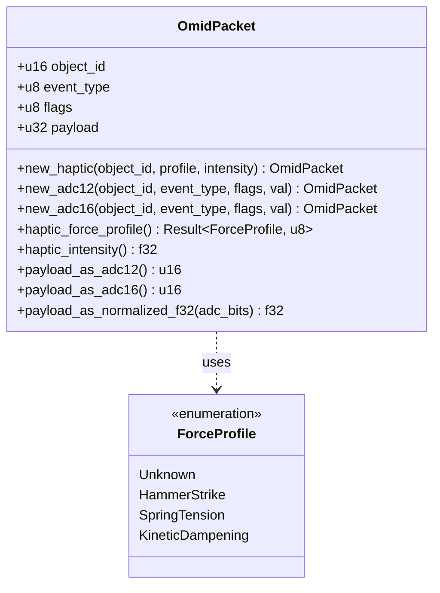
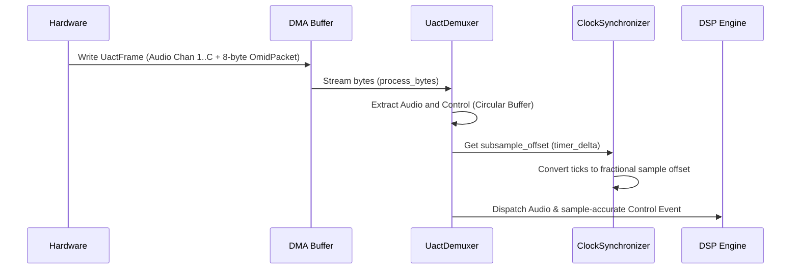
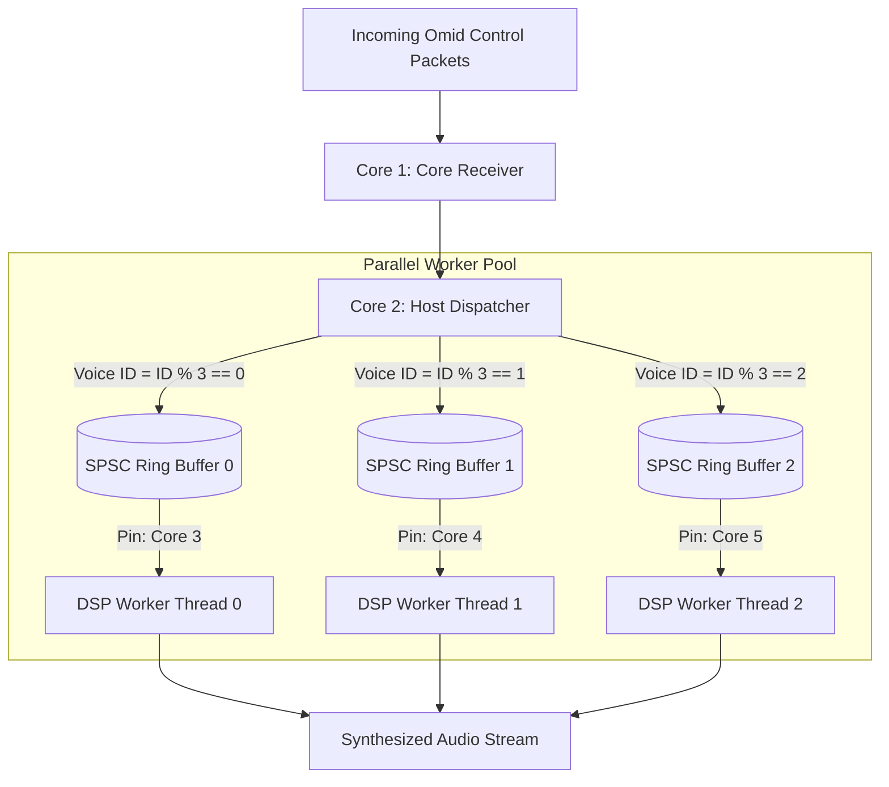
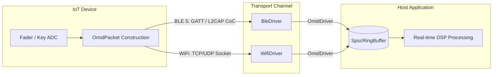
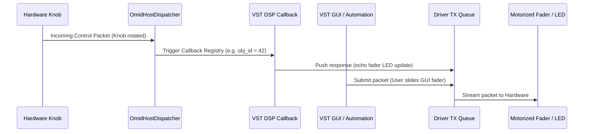

# Omid Diagrams (v2.0.0)

This document visualizes the Omid Version 2.0.0 architecture using Mermaid diagrams.

---

## 1. Unified OmidPacket Structure



---

## 2. UACT Streaming Pipeline & Clock Sync

This sequence demonstrates zero-copy audio/control interleaving and sample-accurate synchronization.



---

## 3. Lock-Free Host Parallel Dispatcher

Visualizing the routing of control events to isolated, pinned cores without mutex bottlenecks.



---

## 4. IoT Connection Pipelines (BLE 5 & WiFi)



---

## 5. Bidirectional Loop & Dispatcher Callbacks

Demonstrates how parameter updates sync back and forth between VST GUI/DSP and physical hardware.



---

## 6. SpscRingBuffer Cache-Line Memory Layout

Prevents CPU core cache bouncing (false sharing) by isolating indices to different 64-byte boundaries.

```mermaid
graph LR
    subgraph Cache Line 1 (64 Bytes)
        buf[Data Buffer Array]
    end
    subgraph Cache Line 2 (64 Bytes)
        write_idx[write_idx: AtomicUsize]
    end
    subgraph Cache Line 3 (64 Bytes)
        read_idx[read_idx: AtomicUsize]
    end
```